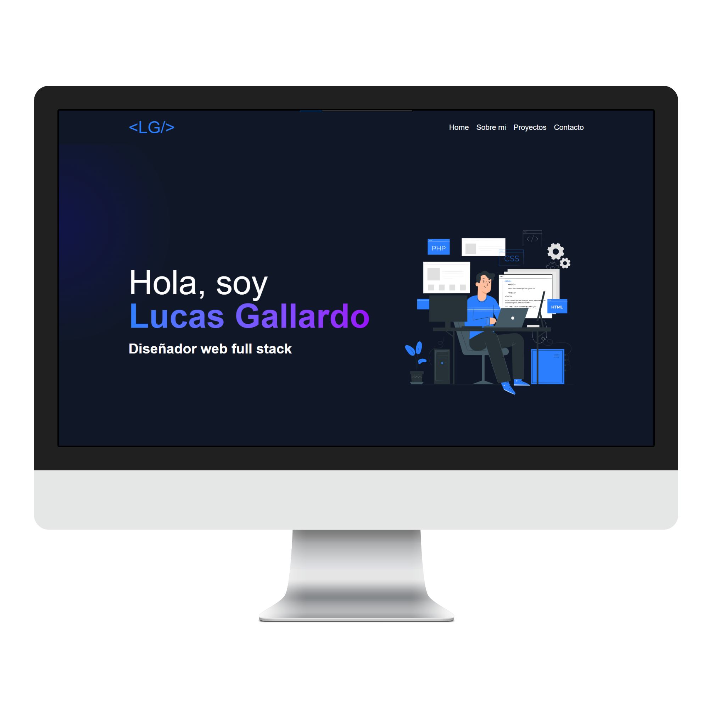

<h2 align="center">
  Portafolio Website - v2.0 
  <a href="" target="_blank">Lucas Gallardo</a>
</h2>

  

## Tecnologías utilizadas

- **Astro**: Framework para sitios estáticos.
- **Tailwind CSS**: Framework de estilos para diseño responsivo.
- **JavaScript**: Lógica interactiva.
- **HTML5 y CSS3**: Estructura y estilos básicos.
- **Github Pages**: Hosting para el despliegue.

## Características

- Diseño moderno y responsivo.
- Sección de proyectos con detalles y enlaces a repositorios.
- Descarga de CV en formato PDF.
- Animaciones suaves y transiciones.
- Optimización para SEO y rendimiento.

## Contacto

Si tienes alguna pregunta o sugerencia, no dudes en contactarme:

- **Email**: lucasomargallardo@gmail.com
- **LinkedIn**: [Lucas Gallardo](https://www.linkedin.com/in/lucas-omar-gallardo/)
- **GitHub**: [Lukitaaaaa](https://github.com/Lukitaaaaa)

## Licencia

Este proyecto está bajo la licencia MIT. Puedes usarlo, modificarlo y distribuirlo libremente. Consulta el archivo [LICENSE](./LICENSE) para más detalles.